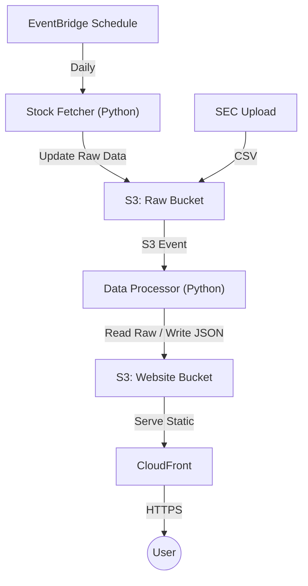

# Python-Centric AWS Deployment Guide

This guide outlines a fully automated data pipeline and website hosting strategy using **Python** as the primary language for data processing, ensuring easy deployment and maintenance on AWS.

## Proposed Architecture (Python Pipeline)

## Infrastructure Components

- **S3 Buckets**:
  - `ceo-impact-raw-data`: Stores `data.csv`, `sec_filings_results.csv`, and `stock_data_raw/`.
  - `ceo-impact-website`: Stores the React build and `public/data/`.
- **Lambda Functions (Python 3.12)**:
  - `StockFetcher`: Fetches daily prices via `yfinance`.
  - `DataProcessor`: A Python port of the preprocessing logic (using Pandas) to rebuild `companies.json`.
- **CloudFront**: Serves the website over HTTPS with global caching.

## Script Adaptations

### Stock Fetcher (extract.py)
- Use `boto3` for S3 interactions.
- Fetch only the most recent trading day's data to keep it fast.

### Data Processor (preprocess.py)
- Replaces `preprocess.mjs`.
- Uses **Pandas** for all calculations (Transition detection, Volatility, Impact).
- Uses `boto3` to read from the Raw bucket and write to the Website bucket.

## Deployment Steps
1. Create S3 buckets.
2. Deploy Lambda functions using the Python 3.12 runtime.
3. Set up EventBridge for daily triggers.
4. Configure S3 Event Notifications on the Raw bucket to trigger the DataProcessor Lambda.
5. Build and deploy the React app to the website bucket.
6. Create CloudFront distribution.
